## Advanced Lane Finding
[](http://www.udacity.com/drive)
<p align="center">
  
</p>

In this project, the goal was to write a software pipeline to identify the lane boundaries in a video. The final result can be seen on [youtube](https://www.youtube.com/watch?v=ime1Mjpe7Eg). 

The Project
---

The steps of this project was the following:

* Compute the camera calibration matrix and distortion coefficients given a set of chessboard images.
* Apply a distortion correction to raw images.
* Use color transforms, gradients, etc., to create a thresholded binary image.
* Apply a perspective transform to rectify binary image ("birds-eye view").
* Detect lane pixels and fit to find the lane boundary.
* Determine the curvature of the lane and vehicle position with respect to center.
* Warp the detected lane boundaries back onto the original image.
* Output visual display of the lane boundaries and numerical estimation of lane curvature and vehicle position.

For full details on how everything was done, please read below.

## Camera calibration

The camera is calibrated to eliminate radial distortion, this is needed because even if we use a camera with good lens, there is no perfect one, they all distort the image in some way, making the final result different from what is visualized in the real world. To eliminate the radial distortion, it is necessary to find the distortion coefficients k1, k2, k3 and the distance r, which represents the distance between any point to the center of distortion of the image. To find the coefficients, were used 20 pictures taken at different angles from a chessboard, and for each image, an algorithm was applied to detect the edges of the board. This is necessary because the calibrateCamera function, from OpenCV library, uses this information as input to find the distortion coefficients and the transformation matrix, which are necessary to correct the image later using the undistort function. The result of the calibration result can be seen below, where the left images is the distorted ones and the right images is the undistorted images. 

<p align="center">
  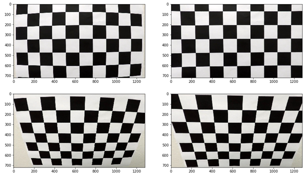
</p>

For more details please see "1 - Camera Calibration.ipynb" notebook.

## Perspective transformation

After performing the camera calibration, the next step is to perform a perspective transformation on the image, so that we can have an bird eye view of the track, and thus, facilitate obtaining a polynomial that can describe the lanes well. To perform the transformation, using an image of the track, it is necessary to define 4 points capable of describing the lanes in the current view, and 4 equivalent points that will describe the lanes in the bird eye view. With the 8 points defined, we can use the getPerspectiveTransform function from OpenCV library, to find the transformation matrix. Finally, using the transformation matrix and warpPerspective function, we obtain the image with a bird eye view of the track. The result of this transformation can be seen below.

<p align="center">
  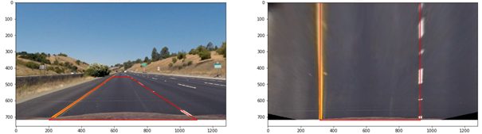
</p>

For more details please see "2 - Perspective Transformation.ipynb" notebook.

## Edge detection

To detect edges, was used images without a perspective transformation. By trial and error, exploring the RGB, HSL and HSV color spaces, it was possible to observe that the channels R (Red) from RGB color space and S (Saturation) from HSL color space were capable of describe the lane lines well in various situations. Besides R and S, Gx and Gy, result of applying the Sobel filter in the X and Y direction of the original image, the gradient (Dir) and magnitude (Mag) of the image, calculated from Gx and Gy, were used. After obtaining the 6 images, a threshold is applied to the pixels of each one, keeping them with a value of 255 in regions of interest and 0 in the others. These thresholds is described below:

<p align="center">
  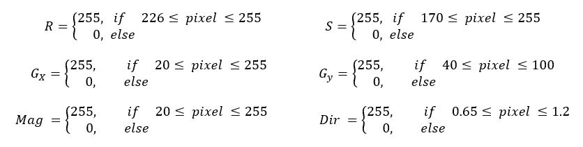
</p>

Por fim, para obter a imagem I, resultante da detecção de bordas em uma determinada imagem, são aplicadas as seguintes operações com as imagens geradas anteriormente:

<p align="center">
  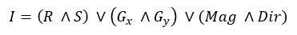
</p>

For more details please see "3 - Edge Detection.ipynb" notebook.

<p align="center">
  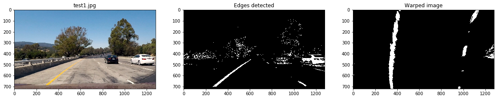
</p>
<p align="center">
  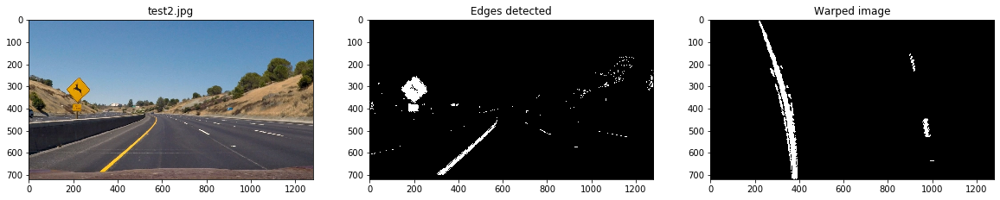
</p>

<p align="center">
  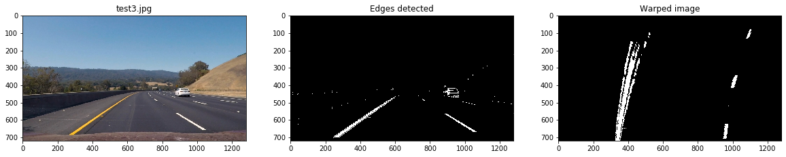
</p>

<p align="center">
  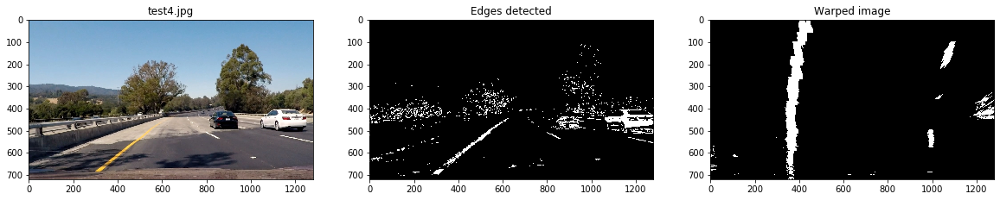
</p>


## Lane detection

For the lane detection, first is applied a perspective transformation in the image I, then it is divided into 10 parts on the Y axis, and for each part, a histogram is generated along the X axis, to count the number of pixels with a value of 255 in each division. Below there is an example of histogram.

<p align="center">
  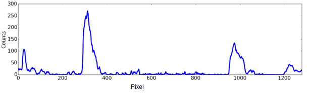
</p>

Then, the 10 histograms is divided in half, and for each division, the points with highest value in the Y axis were found and saved. Applying a polynomial interpolation using the 10 points of the left side and 10 on the right side, a second degree polynomial was generated to describe the curvature of the left and right lanes. 

<p align="center">
  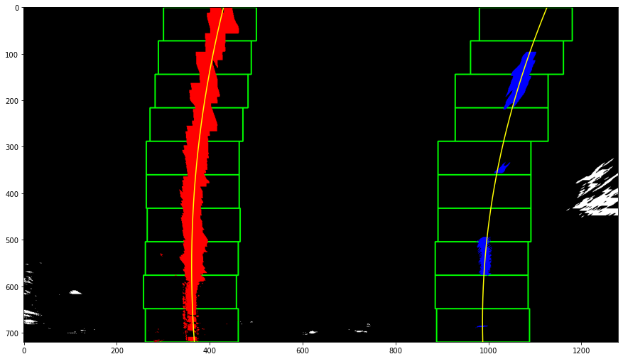
</p>

<p align="center">
  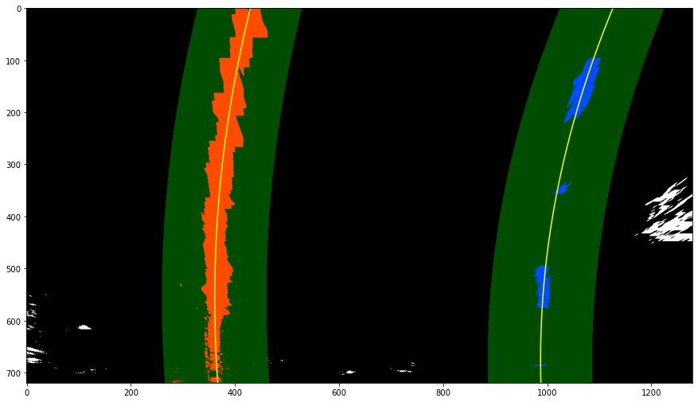
</p>

The final image, with the detected lanes, was obtained by applying a inverse perspective transformation in the perspective transformed image. 

<p align="center">
  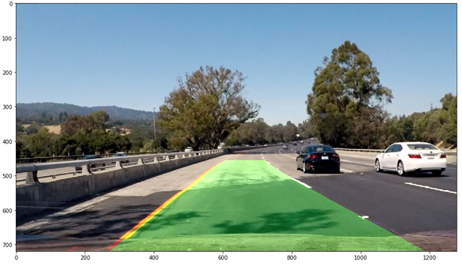
</p>

For more details please see "4 - Lane Detection.ipynb" notebook.

When the lane line is detected in a sequence of images, it is used an average of the points found in the histograms of the previously 25 images, to generate the second degree polynomial for the current image. For more details please see "5 - Full Pipeline.ipynb" notebook.

## Measuring radius of curvature and position of the vehicle

The radius of curvature at any point x of the function x = f(y) is given as follows:

<p align="center">
  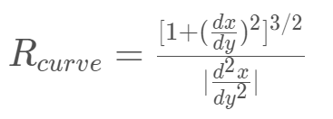
</p>

In the case of the second order polynomial above, the first and second derivatives are:

<p align="center">
  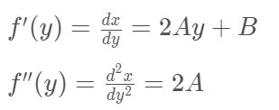
</p>

So, our equation for radius of curvature becomes:

<p align="center">
  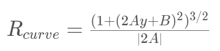
</p>

Where A, B and C are coefficients of the second degree polynomial found for each lane line.

To find the curvature of the lanes in the real world, it is necessary to adjust the values of x and y used to find the coefficients of the second degree polynomial and the radius of curvature of the lane in the previous equation. For that, it is necessary to measure how long and wide the section of lane is that we're projecting in our warped image. We could do this in detail by measuring out the physical lane in the field of view of the camera, but for this project, it was assumed that projecting a section of lane similar to the images above, the lane is about 30 meters long and 3.7 meters wide, so the adjust is:

```
self.ym_per_pix = 30/720   # meters per pixel in y dimension
self.xm_per_pix = 3.7/1280 # meters per pixel in x dimension
```

To find the position of the vehicle with respect to center of the lane, first it is assumed that the camera is positioned in the center of the captured images, that is:
```
camera_position = pixels_x_axis/2
```

then, the center of the lane is obtained from the X points of the left and right lane closest to the vehicle:

```
lane_center = (left_lane_x_closest_vehicle + right_lane_x_closest_vehicle)/2
```

Finally, to find the center offset, it's subtract the camera_position to the lane_center: 

```
center_offset_pixels = camera_position - lane_center
center_offset_mtrs = xm_per_pix*center_offset_pixels
```

